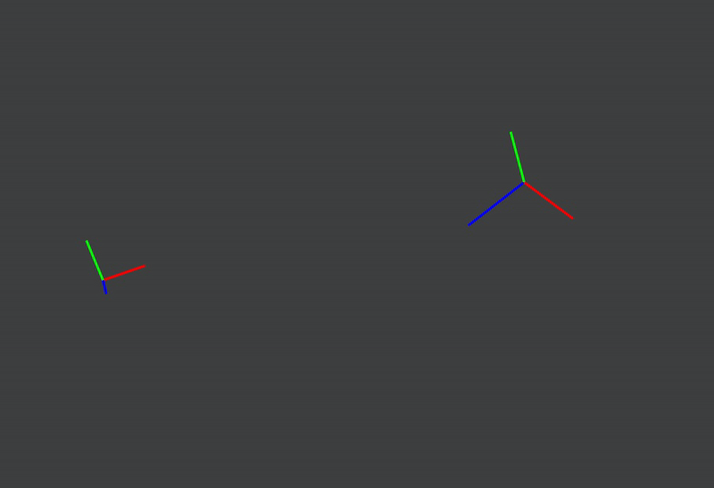

# Slerp-animation
Second homework for Projective Geometry course at the Faculty of Mathematics in Belgrade, Serbia.

Implementation of Slerp animation.

## :floppy_disk: Requirements
Done in C++, using Eigen library and OpenGL.

